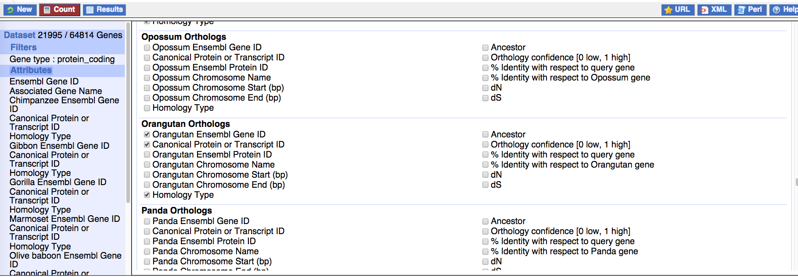

# Genome-scale detection of positive selection in 9 primates

This page contains scripts, analyses and procedures developed in:

> **Genome-scale detection of positive selection in 9 primates predicts human-virus evolutionary conflicts**
> Robin van der Lee, Laurens Wiel, Teunis J.P. van Dam, Martijn A. Huynen  
> bioRxiv 131680; https://doi.org/10.1101/131680

> Centre for Molecular and Biomolecular Informatics - Radboud Institute for Molecular Life Sciences<br/>
> Radboud university medical center<br/>
> Nijmegen, The Netherlands

If you found this resource useful, please consider citing the paper.


## Issues & Contact

Please note that these scripts were not designed to function as a fully-automated pipeline, but rather as a series of steps with extensive manual quality control between them. It will therefore not be straightforward to run all steps smoothly in one go. Please feel free to contact me if you run into any issue with individual steps.

> **robinvanderlee AT gmail DOT com**<br/><br/>
> [Google Scholar](https://scholar.google.co.uk/citations?user=ISYCcUUAAAAJ)<br/>
> [ORCID](http://orcid.org/0000-0001-7391-9438)<br/>
> [Twitter](https://twitter.com/robinvdlee)<br/>
> [LinkedIn](http://nl.linkedin.com/in/robinvdlee)


## Requirements

Scripts depend on various programs and modules to run.

###### Perl
- Install Perl 5: https://www.perl.org/
- Install various modules using `cpan` or `cpanm`
	- `cpanm DBI`
	- `cpanm DBD::mysql`  (requires a working mysql installation, https://www.mysql.com/)
- Download the various helper scripts that are also part of this GitHub repository
	- `functions.pl`
	- Scripts in `Ensembl_API_subroutines`

###### BioPerl
- Install BioPerl   `cpanm Bio::Perl` (http://bioperl.org/)

###### Ensembl API
- Install the Ensembl API (http://www.ensembl.org/info/docs/api/index.html)

###### R
- Install R: https://www.r-project.org/
- Install the following packages:
	- ``

R
	+ modules
	?? gebruik ik dit script? ./Biological_correlations_PSR/basic_statistics_of_data/aa_freqs/analyze_aa_freqs.r:require(lattice)
library("Biostrings")
library("biomaRt")
library("ggplot2")
library("phangorn")
library("session")
library(GenomicRanges)
library(MASS)
library(data.table)
library(dplyr)
library(ggplot2)
library(gplots)
library(gridExtra)
library(jsonlite)
library(parallel)
library(plotrix)
library(rtracklayer)
library(scales)
library(vioplot)


Parallel
PRANK
PAML/CODEML
	make sure they are in your path

Jalview
...

pal2nal?
muscle
mafft

GUIDANCE
t_coffee

NOTE THAT ENSEMBL VERSION USED FOR THE PAPER IS XXX
ENSEMBL 78


## Steps

Please see the `Materials and Methods` section of the paper for detailed explanations.


### 1. One-to-one orthologs
Obtain one-to-one ortholog clusters for nine primates with high-coverage whole-genome sequences. These scripts can be edited to obtain orthology clusters for (i) a different set of species than the ones we use here, and (ii) different homology relationships than the one-to-one filter we use.<br/>
Two methods, same result:

###### 1a. Ensembl API method
1. Fetch orthology information using the Ensembl API: `get_one2one_orthologs__Ensembl_API.pl`
2. Clean the results using: `get_one2one_orthologs__Ensembl_API__process_orthologs.r`

###### 1b. Ensembl BioMart method 
1. From BioMart, first get orthology information for all species of interest


2. Combine the acquired ortholog information using `get_one2one_orthologs__combine_biomart_orthology_lists.r`


### 2. Sequences
For all one-to-one orthologs, get the coding DNA (cds) and the corresponding protein sequences from the Ensembl Compara gene trees (as these trees are the basis for the orthology calls).

###### 2a. Get the sequences
1. Run `start_parallel_sequence_fetching.pl`, which reads the ortholog cluster information, divides the genes in batches of 1000 (`$batchsize` can be changed in the script) and prints the instructions for the next step:
2. `get_sequences_for_one2one_orthologs_from_gene_tree_pipeline.pl`. This step fetches the sequences. E.g.
```
STARTING PARALLEL INSTANCE 11
from 10001 to 11000
1000 genes
screen -S i11
perl get_sequences_for_one2one_orthologs_from_gene_tree_pipeline.pl -p -f sequences/parallel_instance_11.txt
```
Note that these steps also fetch the alignments underlying the Compara gene trees, filtered only for the species of interest. These are not required for later steps.

###### 2b. Check the sequences
`check_compatibility_protein_cds_sequences.pl`. Tends to only complain at annotated selenocysteine residues.


## Supplementary data and material

Additional data and material can be found at:
- This GitHub page: [Supplementary data and material](Supplementary_data_and_material)<br/>

and
- http://www.cmbi.umcn.nl/~rvdlee/positive_selection/


